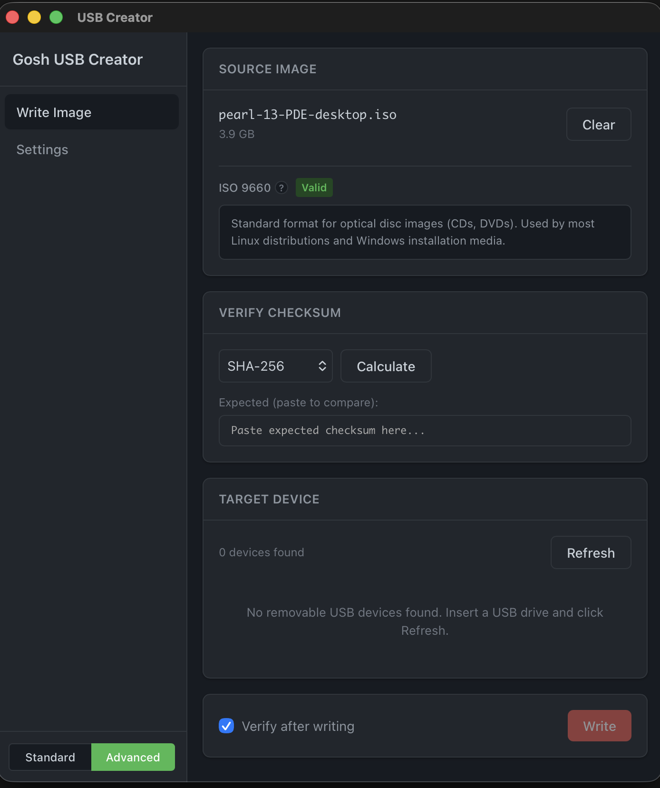
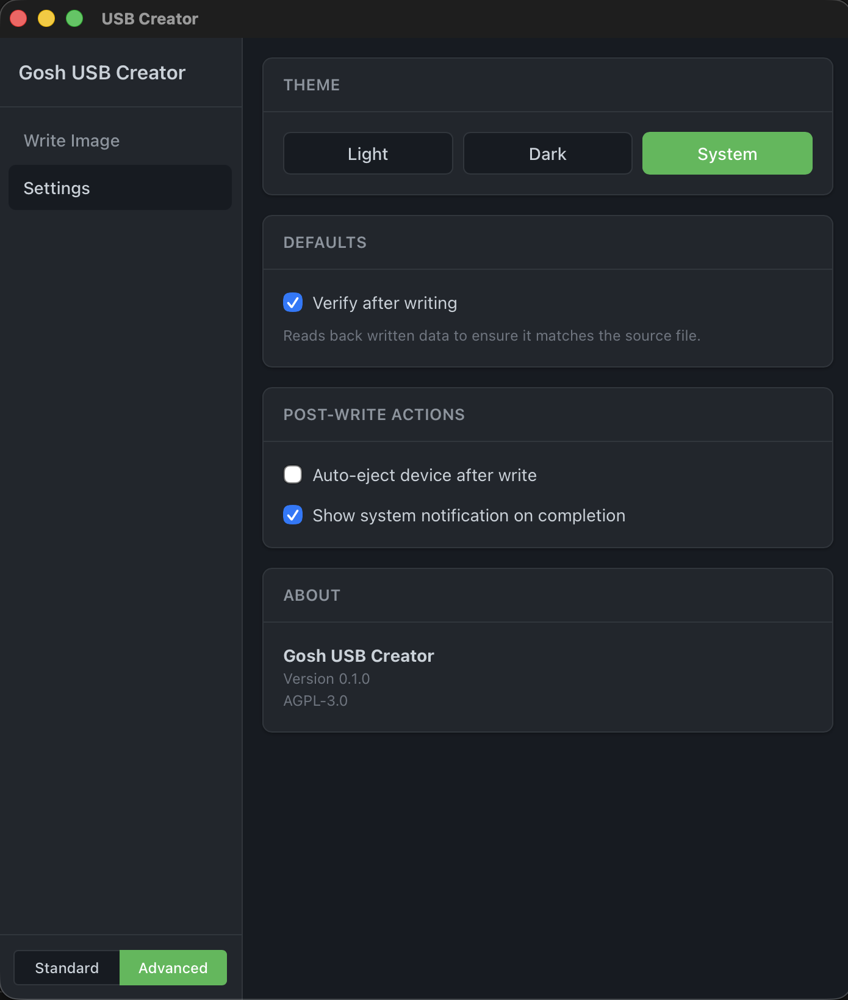

# Gosh USB Creator

A cross-platform USB flash drive creator for Windows, Linux, and macOS. Built with Tauri v2 (Rust) and React/TypeScript.

## Philosophy

Gosh apps are built with a Linux-first mindset: simplicity, transparency, and user control.

We also provide Windows and macOS builds not as a compromise, but as an on-ramp. Many people are curious about Linux but still live on other platforms day-to-day. If these tools help someone get comfortable and eventually make the jump, we're happy to meet them where they are.

## Screenshots




## Features

### Standard Mode
- Write ISO/IMG files to USB drives
- SHA-256 and MD5 checksum calculation
- Post-write verification (reads back written data and compares byte-by-byte to ensure write integrity)
- Cross-platform: Windows, Linux, macOS
- Light/Dark/System theme support
- No telemetry, accounts, or cloud features

### Advanced Mode
All Standard features plus:
- **Pre-write image validation** — Checks source file before writing to confirm it's a valid disk image (ISO 9660, MBR, or GPT format). Click the format name for an explanation of what it means.
- **Size check** — Warns if image file is larger than USB device capacity
- **Auto-eject** — Automatically ejects USB device after successful write
- **Notifications** — System notification when write completes

## Requirements

### All Platforms
- [Node.js](https://nodejs.org/) 18+
- [Rust](https://rustup.rs/) 1.70+

### Linux
- `libwebkit2gtk-4.1-dev`
- `libappindicator3-dev`
- `librsvg2-dev`

On Debian/Ubuntu:
```bash
sudo apt install libwebkit2gtk-4.1-dev libappindicator3-dev librsvg2-dev
```

### Windows
- WebView2 (included in Windows 10/11)

### macOS
- Xcode Command Line Tools

## Building

```bash
# Install dependencies
npm install

# Development
npm run tauri dev

# Production build
npm run tauri build
```

## Usage

1. **Select ISO** - Click or drag an ISO/IMG file
2. **Verify checksum** (optional) - Calculate SHA-256 or MD5 and compare
3. **Select USB device** - Choose the target drive
4. **Write** - Click "Write to USB" (requires admin privileges)

## Permissions

Writing to raw block devices requires elevated privileges:

- **Linux**: Uses `pkexec` for privilege elevation
- **macOS**: Prompts for admin password
- **Windows**: Requires running as Administrator

## Disclaimer

This application is an independent project and is not sponsored by, endorsed by, or affiliated with GitHub or GitHub, Inc.

This software is licensed under the GNU Affero General Public License v3.0 (AGPL-3.0). It is provided "as is", without warranty of any kind, express or implied, including but not limited to the warranties of merchantability or fitness for a particular purpose. Use at your own risk.

## License

AGPL-3.0 - See [LICENSE](LICENSE)

## Roadmap

Planned features for future releases:

- **Compressed Image Support** - Write `.iso.gz`, `.iso.xz`, `.img.zip` directly without manual extraction
- **Multi-Device Write** - Clone the same image to multiple USB drives simultaneously
- **Bootable Validation** - Verify written USB is bootable (BIOS/UEFI detection)
- **Persistent Volume** - Create persistence partition for Linux live USBs
- **Ventoy-Style Multi-Boot** - Multiple ISOs on one USB with boot menu

## Contributing

Contributions welcome. Please open an issue first for major changes.
